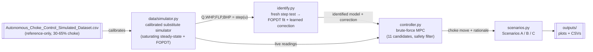
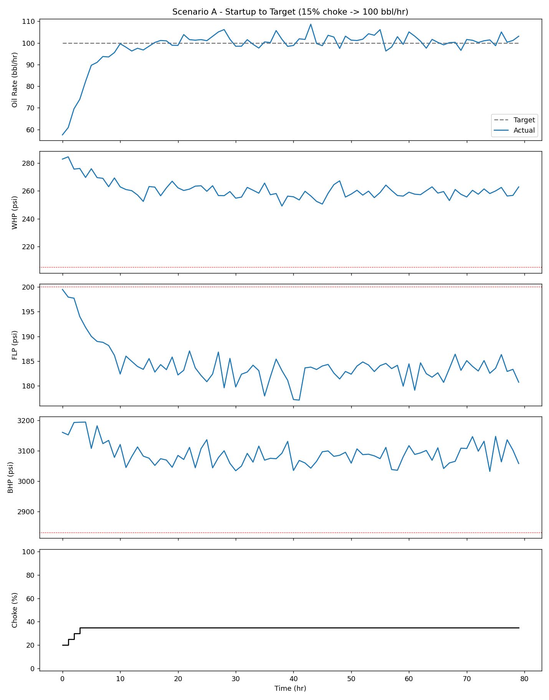
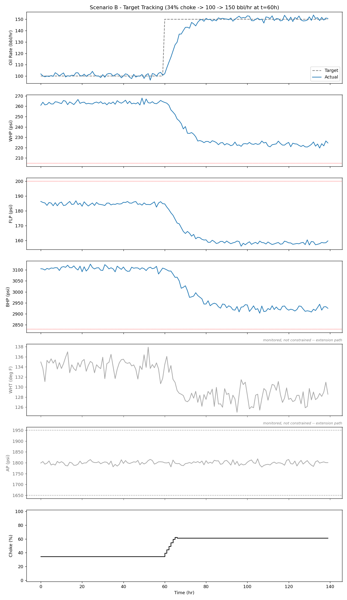
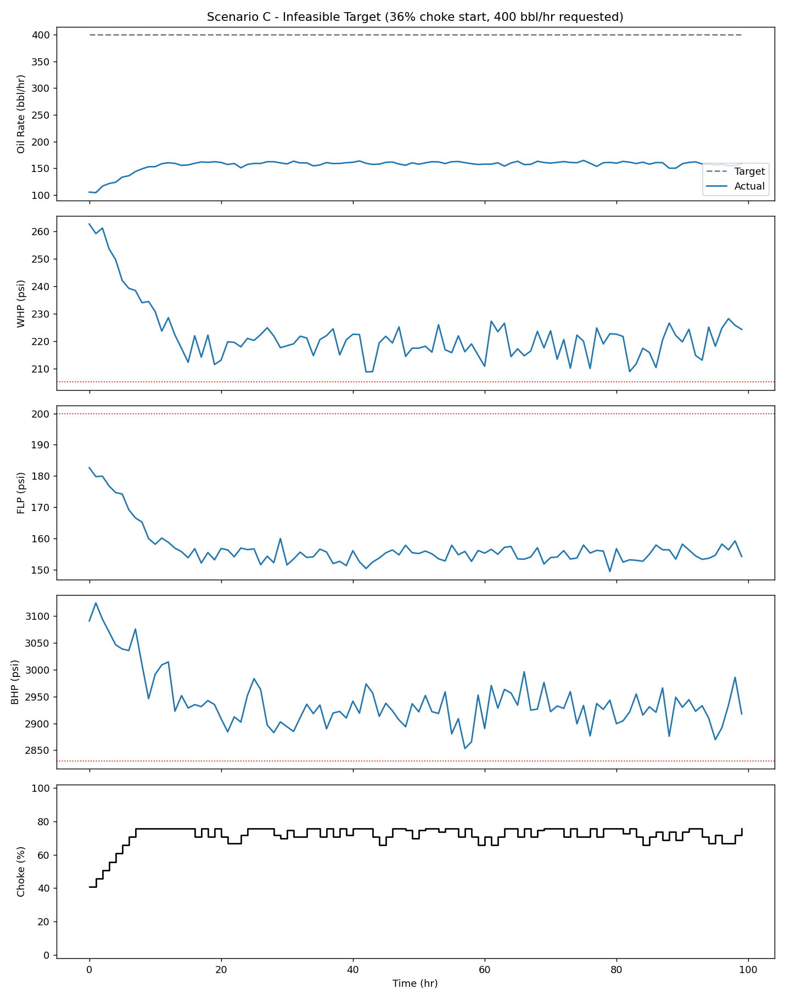

# ChokePilot — Autonomous Choke Controller

Honeywell Campus Connect Hackathon (PS3): an autonomous controller for a single
naturally flowing oil well's production choke. Given a target oil rate, it picks
choke moves (±5% per hour) that chase the target while never letting wellhead,
flowline, or bottom-hole pressure leave a safe operating envelope — and if the
target itself is unsafe, it settles at the best rate it safely can instead of
chasing it into a violation.

No official simulator was provided for this challenge — only a reference dataset.
Everything here, including the simulator itself, is built and clearly labeled
around that constraint. See [`CLAUDE.md`](CLAUDE.md) for the full working log and
[`docs/report.md`](docs/report.md) / [`docs/presentation.md`](docs/presentation.md)
for the write-up.

## Quickstart

```bash
pip install numpy pandas matplotlib

python data/simulator.py   # self-check: calibrated simulator vs reference CSV
python identify.py         # step test + FOPDT identification + learned correction
python controller.py       # self-check: MPC picks sane moves in two toy cases
python scenarios.py        # runs Scenarios A/B/C, writes plots + CSVs to outputs/
```

## Architecture



`simulator.py` stands in for the plant (calibrated once, fit to the CSV).
`identify.py` treats it as a black box and runs its own experiment against it —
the model `controller.py` predicts with comes from that fresh identification, not
from the simulator's internals.

## Key results

| Scenario | Setup | Final | Constraint violations |
|---|---|---|---|
| A — Startup to Target | 15% choke → 100 bbl/hr, 80h | 104.0 bbl/hr @ 35% choke | 3/80 (residual ramp-limited transient) |
| B — Target Tracking | 35.7% choke, 100→150 bbl/hr step at t=60h, 140h | 148.3 bbl/hr @ 66% choke | 0/140 |
| C — Infeasible Target | 35.7% choke, 400 bbl/hr requested, 100h | 158.8 bbl/hr @ 76% choke (max safe rate) | 0/100 |

Ramp-rate (±5%/interval) violations: 0/300 across all three runs.

<p>
  
  
  
</p>

Every choke move is logged with a one-sentence, human-readable rationale (a real
CSV field, not just a design principle) — e.g. *"Moved choke to 35% because it
keeps WHP/FLP/BHP within safe limits over the next 10h and brings predicted oil
rate to 99.9 bbl/hr, closest to the 100.0 bbl/hr target among 10 feasible
options."*

## Known limitations

- **No official simulator.** `data/simulator.py` is a calibrated substitute fit to
  the reference CSV, clearly commented as such — swap in the real one if it
  becomes available; nothing downstream depends on its internals, only on
  `.step()`.
- **Safety limits are placeholders**, derived from the reference CSV's observed
  range + 20% margin (the brief specifies no numeric limits).
- **The calibrated model's real support is the CSV's tested 30–65% choke band.**
  All three scenarios are deliberately started inside that band (or, for Scenario
  A, as close to it as the startup demonstration allows) rather than at a hard 0%
  extreme — see `CLAUDE.md`'s "Known limitation" section for the before/after
  numbers this decision produced.

## Repo structure

```
data/
  Autonomous_Choke_Control_Simulated_Dataset.csv   reference dataset (not reused for model ID)
  simulator.py                                     calibrated substitute simulator
identify.py                                        open-loop step test + FOPDT + learned correction
controller.py                                       brute-force MPC controller
scenarios.py                                        runs Scenarios A/B/C, saves plots to outputs/
outputs/                                             generated plots + CSVs
docs/
  report.md                                          full write-up
  presentation.md                                    slide-formatted version
CLAUDE.md                                             working log / decisions / status
```
