# ChokePilot — Autonomous Choke Controller

Honeywell Campus Connect Hackathon (PS3): an autonomous controller for a single
naturally flowing oil well's production choke. Given a target oil rate, it picks
choke moves (±5% per hour) that chase the target while never letting wellhead,
flowline, or bottom-hole pressure leave a safe operating envelope — and if the
target itself is unsafe, it settles at the best rate it safely can instead of
chasing it into a violation.

No official simulator was provided for this challenge — only a reference dataset.
Everything here, including the simulator itself, is built and clearly labeled
around that constraint. See [`CLAUDE.md`](CLAUDE.md) for the full working log and
[`docs/report.md`](docs/report.md) / [`docs/presentation.md`](docs/presentation.md)
for the write-up.

## Quickstart

```bash
pip install -r requirements.txt

python data/simulator.py         # self-check: calibrated simulator vs reference CSV
python identify.py               # step test + FOPDT identification + learned correction
python verify_identification.py  # identified-vs-true accuracy across 5 seeds -> results.json
python controller.py             # self-check: MPC picks sane moves in two toy cases
python scenarios.py              # runs Scenarios A/B/C, writes plots + CSVs -> results.json
python baselines.py              # MPC vs. Fixed-optimal vs. Fixed-operator-proxy vs. PI -> results.json
python seed_sweep.py             # 30-seed violation/fallback distribution per scenario
python scenario_d.py             # Scenario D - Disturbance Rejection (reservoir decline)
python -m pytest tests/          # 41 tests: actuator constraints, identification, safety envelope
python generate_docs.py          # re-render this file / docs/report.md / docs/presentation.md
                                  # from outputs/results.json after any of the above changes it
```

## Architecture

```mermaid
flowchart LR
    CSV[["Autonomous_Choke_Control_Simulated_Dataset.csv\n(reference-only, 30-65% choke)"]]
    SIM["data/simulator.py\ncalibrated substitute simulator\n(saturating steady-state + FOPDT)"]
    ID["identify.py\nfresh step test →\nFOPDT fit + learned correction"]
    CTRL["controller.py\none-step receding-horizon search\n(11 candidates, safety filter)"]
    SCEN["scenarios.py / baselines.py / scenario_d.py\nScenarios A / B / C / D"]
    JSON[["outputs/results.json"]]
    OUT[["README / docs\n(generate_docs.py)"]]

    CSV -- calibrates --> SIM
    SIM -- Q,WHP,FLP,BHP = step(u) --> ID
    ID -- identified model + correction --> CTRL
    SIM -- live readings --> CTRL
    CTRL -- choke move + rationale --> SCEN
    SCEN --> JSON
    JSON --> OUT
```



`simulator.py` stands in for the plant (calibrated once, fit to the CSV).
`identify.py` imports the simulator's own private fitting functions and runs a fresh
step test against it — the model shares its functional form with the simulator's
calibration *by construction*, not a black-box rediscovery (`docs/report.md` §1.2).
`scenarios.py`, `baselines.py`, and `verify_identification.py` each write their key
numbers into `outputs/results.json`; `generate_docs.py` renders every table below
from that one file, so this README, `docs/report.md`, and `docs/presentation.md`
can't quietly drift out of sync with each other or with the shipped CSVs.

## Key results

<!-- GENERATED:scenario_key_results_table -->
| Scenario | Setup | Final | Constraint violations |
|---|---|---|---|
| A — Startup to Target (15% choke -> 100 bbl/hr) | start 15.0% choke, 80h run | 99.9 bbl/hr @ 34% choke | 4/80 |
| B — Target Tracking (34% choke -> 100 -> 150 bbl/hr at t=60h) | start 34.2% choke, 140h run | 150.4 bbl/hr @ 61% choke | 0/140 |
| C — Infeasible Target (34% choke start, 400 bbl/hr requested) | start 34.2% choke, 100h run | 160.8 bbl/hr @ 66% choke | 0/100 |
<!-- END GENERATED -->

Ramp-rate (±5%/interval) violations: 0 across all three runs. A fourth scenario,
D — Disturbance Rejection (reservoir decline over 200h), is not yet part of the
`results.json` pipeline (see `docs/report.md` §3.6) but is fully documented there.

<p>
  
  
  
</p>

Every choke move is logged with a one-sentence, human-readable rationale (a real
CSV field, not just a design principle) — e.g. a real logged decision from Scenario
A: *"Moved choke to 34.0% because it keeps WHP/FLP/BHP within safe limits over the
next 12h and brings predicted oil rate to 99.3 bbl/hr, the best tradeoff between
closing the 100.0 bbl/hr target gap and unnecessary valve movement among 11 feasible
options."*

## Known limitations

- **No official simulator.** `data/simulator.py` is a calibrated substitute fit to
  the reference CSV, clearly commented as such — swap in the real one if it
  becomes available; nothing downstream depends on its internals, only on
  `.step()`.
- **Safety limits are placeholders**, derived from the reference CSV's observed
  range + 20% margin (the brief specifies no numeric limits), and are one-sided
  (WHP/BHP floor-only, FLP ceiling-only) — see `docs/report.md` §1.4.
- **The calibrated model's real support is the CSV's tested 30–65% choke band.**
  Scenario A's residual violations are a deterministic consequence of starting
  below that band (not "extrapolation uncertainty" — see `docs/report.md` §2.3);
  Scenarios B/C/D start fully inside it.
- **WHT and AP are monitored, not constrained.** Wellhead Temperature and
  Annulus Pressure are simulated and plotted (grey traces in every scenario
  figure) since the brief lists them as part of a complete production
  operating envelope, but — since neither has a reference-CSV column to
  calibrate against — their curves are hand-set placeholder parameters, and
  they never feed the controller's safety check or MPC objective.
- **The controller is a one-step receding-horizon search, not full MPC** — no
  recursive feasibility guarantee, safety is empirically strong but not formally
  proven (`docs/report.md` §2.1).

## Repo structure

```
data/
  Autonomous_Choke_Control_Simulated_Dataset.csv   reference dataset (not reused for model ID)
  simulator.py                                     calibrated substitute simulator
identify.py                                        open-loop step test + FOPDT + learned correction
verify_identification.py                           identified-vs-true accuracy diagnostic (5 seeds)
controller.py                                      one-step receding-horizon controller
scenarios.py                                        runs Scenarios A/B/C, saves plots to outputs/
baselines.py                                        MPC vs. Fixed-optimal vs. Fixed-operator-proxy vs. PI
scenario_d.py                                       Scenario D - Disturbance Rejection
seed_sweep.py                                       30-seed violation/fallback distribution
results_io.py                                       shared outputs/results.json read/write helper
generate_docs.py                                    renders this README + docs/*.md from results.json
tests/                                               41 pytest tests (actuator, identification, safety)
outputs/                                             generated plots, CSVs, results.json
docs/
  report.md                                          full write-up
  presentation.md                                    slide-formatted version
CLAUDE.md                                             working log / decisions / status
```
