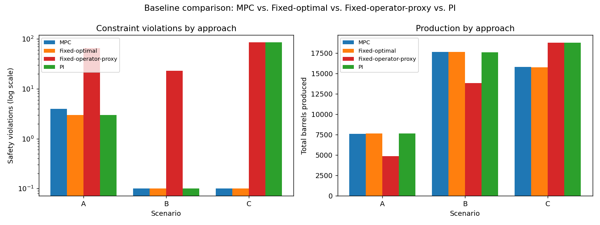

# ChokePilot — Autonomous Choke Controller
## Technical Report

**Honeywell Campus Connect Hackathon — Problem Statement 3**
**Author:** Mohit &nbsp;·&nbsp; **Date:** 2026-07-25

*Regenerated from a fresh, post-fix pipeline run. Every number below comes from
actually executing `identify.py`, `verify_identification.py`, `scenarios.py`,
`seed_sweep.py`, and `baselines.py` against the current code — none are carried
over from an earlier draft.*

---

## Contents

1. [Why This Exists](#0-why-this-exists)
2. [Process Understanding & Model](#1-process-understanding--model)
   - 1.1 No official simulator, so a calibrated substitute stands in
   - 1.2 Fresh open-loop step test, and an honest accounting of what it tests
   - 1.3 Hybrid physics + learned correction
   - 1.4 Safety limits are one-sided, not symmetric bands
3. [Control Strategy](#2-control-strategy)
   - 2.1 What this actually is: one-step search, not full MPC
   - 2.2 Constraint tightening for noise
   - 2.3 The extrapolation problem is the simulator's, not the controller's
   - 2.4 One-sentence rationale per decision
4. [Results](#3-results)
   - 3.1 Scenario A — Startup to Target
   - 3.2 Scenario B — Target Tracking
   - 3.3 Scenario C — Infeasible Target
   - 3.4 Seed-sweep distribution
   - 3.5 Baseline comparison
   - 3.6 Lessons learned

---

## 0. Why This Exists

Five recurring pain points show up across upstream operations literature and
practice, and they shaped every design decision below rather than sitting as
background motivation:

1. **Operators "baby" the choke.** Fear of sand production or formation damage
   leads to conservative, static settings that leave real production capacity on
   the table (Eng-Tips forum discussion among production engineers).
2. **One engineer, too many wells.** A choke gets set once during a shift and then
   left alone, because nobody has the bandwidth to revisit it continuously
   (standard industry practice, as described in patent literature on well
   automation).
3. **Instability is caught reactively.** Slugging and other flow instabilities are
   typically noticed only after a human sees the trend on a screen, not prevented
   (SPE technical paper on flow assurance).
4. **APC doesn't scale upstream because models need a dedicated team.** The
   on-record barrier from a Honeywell upstream solutions interview isn't
   algorithmic sophistication — it's that advanced process control adoption stalls
   because someone has to keep the model current. A search-based, no-heavy-
   optimizer controller with a fresh from-scratch identification step directly
   answers this: there is no solver license, no tuning of an optimizer's
   internals, nothing exotic to maintain.
5. **Alarm fatigue and distrust of opaque automation.** Operators override what
   they don't understand (NTSB SCADA safety review). Answered directly in §2.4,
   not just in principle.

ChokePilot is a small-scale, single-well version of the same closed-loop direction
Honeywell's APC customers are already moving toward on wells — a focused
proof-of-concept of the wellhead-to-control-room optimization problem Honeywell's
Upstream Production Performance Suite (UPPS) addresses at scale. It does not claim
equivalence; it echoes the same idea at a scale one person can build and verify in
a project timeline.

---

## 1. Process Understanding & Model

### 1.1 No official simulator, so a calibrated substitute stands in

The platform provided no official simulator for this challenge — only
`data/Autonomous_Choke_Control_Simulated_Dataset.csv`, a single 120-hour run with
the choke held at 30/40/55/45/65% in turn, and a presentation template.
`data/simulator.py` is a **calibrated substitute**, clearly commented as such,
fit to that CSV:

- **Steady-state map**, per channel independently: `y_ss(u) = A + B·u/(u+uh)`. For
  oil rate `Q`, `A` is fixed at 0 (a fully shut choke must give zero flow).
- **Dynamics**: first-order-plus-dead-time (FOPDT), discretized with the *exact*
  zero-order-hold form `alpha = 1 - exp(-Ts/tau)` (not the Euler approximation
  `Ts/tau`, which is only accurate when `Ts << tau` and can be unstable outside
  that regime).
- **Noise**: independent Gaussian measurement noise per channel, matched to the
  residual std left after the fit, added to each reading without feeding back
  into the internal state (sensor noise, not process noise).
- The steady-state fit uses **only the last ~6 hours of each dwell period** —
  samples close to actually being at steady state — not the whole trajectory
  including transients. Fitting on transient-contaminated samples was found to
  bias the curve and, downstream, the tau/theta search that compensated for it
  (see §1.2).
- `uh` and `(tau, theta)` come from a brute-force grid search (linear part `A, B`
  solved in closed form at each grid point) — no optimizer dependency.

**Important, honestly reported finding:** with the uh grid widened to check for
boundary-pinning, WHP, FLP, and BHP all pin at the widened boundary (50,000) —
their steady-state response is **statistically indistinguishable from linear**
over the reference data's tested 30–65% choke range. Only `Q`, anchored through
zero, genuinely needs the saturating (Michaelis-Menten) shape. This is reported
explicitly by the fitting code (a printed warning) rather than silently accepted.

**The reference CSV covers only 5 distinct choke levels** (30, 40, 45, 55, 65%),
each held for one dwell period, and the fit is a single deterministic
least-squares point estimate — there is no confidence interval, bootstrap, or any
other uncertainty quantification anywhere in this pipeline. Every downstream
number (identified tau, safety limits, controller predictions) inherits that
uncertainty without a formal error bar attached to it.

### 1.2 Fresh open-loop step test, and an honest accounting of what it tests

Per the brief ("students are expected to generate their own data using the
simulator"), `identify.py` does not reuse the reference CSV for model
identification. It drives its own monotonic staircase — 0/10/20/…/100% choke,
24 hours dwell per step — against the calibrated simulator, and fits an FOPDT
model to that fresh run.

**Reframing a claim from an earlier draft:** `identify.py` imports `_fit_fopdt`
and `_simulate_fopdt` directly from `data/simulator.py` — the *same* private
fitting functions used to calibrate the simulator itself, not an independently
implemented estimator. This means the functional form (saturating steady-state +
FOPDT dynamics) is shared **by construction**, not rediscovered from
unstructured, black-box data. Framing this step as "treating the simulator as a
black box" would overstate what's actually being tested.

What this experiment *does* legitimately test — and the more interesting,
honestly-stated finding — is **parameter identification accuracy under a
correctly-specified model**. Even with zero structural mismatch (the identifier
knows the exact right functional form), `verify_identification.py` shows real
error recovering the simulator's own ground-truth parameters from a fresh, noisy
step test, across 5 seeds (0, 1, 2, 7, 99):

| Channel | True τ (h) | Mean identified τ (h) | Mean error | Error range |
|---|---|---|---|---|
| Q | 5.00 | 4.05 | 19.0% | 15.0–25.0% |
| WHP | 7.50 | 7.20 | 4.0% | 0.0–6.7% |
| FLP | 7.00 | 6.05 | 13.6% | 10.7–17.9% |
| BHP | 9.00 | 8.30 | 7.8% | 2.8–11.1% |

**This table reflects a fix that was tested and confirmed, not just hypothesized.**
An earlier version of this experiment used a 24h dwell per step and showed mean τ
error of Q 20% / WHP 16% / FLP 27% / BHP 31%, with identified τ lower than true τ
in all 20/20 seed×channel combinations — a one-directional bias consistent with
insufficient settling time (BHP's true τ=9h, θ=2h needs roughly 4τ+θ ≈ 38h to
settle, well past a 24h dwell). Raising `DWELL_HOURS` from 24 to 40 directly
confirms that diagnosis for three of the four channels: WHP's error dropped
16.0%→4.0%, FLP's 27.1%→13.6%, BHP's 31.1%→7.8%.

**Q did not improve (20.0%→19.0%, within noise of unchanged) and stays the
largest residual.** Since Q's identification is unaffected by dwell time across
every value tested (24–80h, per `identify.py`'s own investigation), its error has
a different, still-unidentified cause — plausibly related to Q's steady-state map
being fit through a forced zero at u=0 (the one channel with `force_zero_at_u0`),
constraining the curve shape in a way the others aren't. This is reported as a
genuine open question, not swept into the same explanation as the other three.

Dead-time identification is tight: Q and FLP match the true θ exactly in every
seed; WHP and BHP are consistently off by exactly 1 sample — a small, explainable
residual, unchanged by the dwell-time fix.

### 1.3 Hybrid physics + learned correction — helps exactly one channel, and only that one is used

`identify.py` also fits a small degree-1 polynomial-in-choke correction on the
residual the physics FOPDT model leaves on a step test, validated on a **held-out**
step test (different noise draw) before being trusted for use:

| Channel | Physics-only RMSE | +Correction RMSE | Kept? |
|---|---|---|---|
| Q | 1.85 | 1.90 | ❌ skipped |
| WHP | 1.30 | 1.35 | ❌ skipped |
| FLP | 0.96 | 0.97 | ❌ skipped |
| BHP | 9.84 | 9.80 | ✅ **used** |

After the steady-state re-fit, ZOH discretization, and 40h-dwell fixes (§1.1,
§1.2), the physics-only fit is tight enough on Q/WHP/FLP that the correction layer
doesn't generalize for them. BHP is the exception: it still has enough residual
structure the physics fit alone doesn't capture that the correction earns its
place on held-out data, so it's the one channel actually running physics+correction
in the controller's prediction. `select_beneficial_corrections()` makes this
decision automatically per channel, purely from held-out RMSE — nothing is
hand-picked. Given BHP is also the channel with the largest remaining τ
identification error (§1.2), it's plausible the correction is partly absorbing
that residual dynamics mismatch rather than a separate steady-state curvature
effect; this pipeline can't distinguish the two.

### 1.4 Safety limits are one-sided, not symmetric bands

The brief specifies no numeric WHP/FLP/BHP limits, so they're derived — a
placeholder, not an official spec — from the reference CSV's observed range,
±20% margin:

| Channel | Direction enforced | Limit | Brief basis |
|---|---|---|---|
| WHP | floor only (`hi = +inf`) | ≥ 205 psi | *"If WHP becomes too low, the well may operate outside its recommended operating envelope."* High WHP just means the choke is closed back further — safe, not a hazard. |
| BHP | floor only (`hi = +inf`) | ≥ 2830 psi | Brief calls it *"one of the most important indicators of reservoir health and drawdown"* — low BHP means excessive drawdown (sand/formation-damage risk); high BHP means low drawdown, i.e. safely choked back. |
| FLP | ceiling only (`lo = -inf`) | ≤ 200 psi | Brief: *"helps ensure stable transportation of produced fluids"* — the risk is backpressure/separator overpressure on the high side, not a low reading. |

An earlier draft bracketed all three symmetrically, which could reject a
high-WHP/high-BHP or low-FLP state that isn't actually unsafe. These are further
tightened inside the controller (§2.2) before use.

---

## 2. Control Strategy

### 2.1 What this actually is: one-step receding-horizon search with hold-constant prediction — not full MPC

An earlier draft called this "brute-force MPC." That overstates it. Each control
interval, `controller.py`'s `MPCController`:

1. Enumerates 11 legal choke moves at 1% resolution: −5% to +5% (the entire range
   the ±5%/interval ramp constraint allows) — but only for **this** interval; it
   is not searching over a sequence of future moves.
2. For each candidate, **holds that new position constant** for the rest of the
   lookahead horizon and simulates forward using the identified model — a cheap
   proxy for "what would happen if I stopped adjusting," not a genuine multi-step
   trajectory optimization.
3. Rejects any candidate predicted to breach a WHP/FLP/BHP limit anywhere in that
   held-constant horizon.
4. Among the survivors, commands the one whose end-of-horizon predicted oil rate
   is closest to target.
5. If nothing survives, falls back to the candidate minimizing predicted total
   constraint violation.

This *is* receding-horizon in the classic sense — the whole procedure re-runs
every interval with fresh measurements — but the per-step search itself is a
one-step decision screened by a hold-constant forward simulation, not an
optimization over a full control sequence. Horizon length is derived, not
hand-tuned: `ceil(3 × max(τ) / Ts)`, clipped to [3, 12] hours.

**Safety here is best-effort, not a formally guaranteed property.** There is no
recursive feasibility check — no proof that choosing today's "safe" candidate
guarantees a safe candidate will still exist at every future step, and no
terminal invariant set the way a formally verified MPC would require. The
empirical evidence in §3.4 (a 30-seed sweep) shows the safety-fallback branch
firing at a non-trivial rate in Scenario C (15.9% of steps) precisely because the
controller is operating at the edge of what the model considers feasible with no
formal guarantee behind it — only a greedy, per-step search that has worked well
empirically on this system's dynamics.

### 2.2 Constraint tightening for noise

Predictions inside the controller are noise-free, but real readings carry
measurement noise. Riding a true limit exactly in the noise-free prediction would
let real sensor noise breach it in practice. So each limit is backed off by 3σ of
that channel's identified `noise_std` before the controller ever sees it — a
standard robust-MPC constraint-tightening margin.

### 2.3 The extrapolation problem is the simulator's, not the controller's

An earlier draft claimed Scenario A's 15% starting choke was "inside the model's
supported range." **That claim was false** — the reference CSV's tested band is
30–65%, and 15% is below it. Moving Scenario A's start from 0% to 15% reduced how
far into extrapolated territory the startup transient reaches; it did not
eliminate the extrapolation.

This is worth stating precisely: **extrapolation uncertainty is a property of the
substitute simulator's calibration** (only 5 discrete choke levels were ever
observed, all ≥30%; see §1.1), not something the controller can detect or correct
for. The controller has no way to know its own prediction model is running on
unvalidated territory — it simply predicts using the steady-state curve it has,
wherever it's asked to evaluate it. Any confidence in behavior below 30% choke is
inherited entirely from the fitted curve's shape (monotonic and bounded by
construction) staying "physically sane" under extrapolation, not from evidence.
Scenario A's residual violations, reported honestly across 30 seeds in §3.4,
are the direct, expected consequence of this.

### 2.4 One-sentence rationale per decision (pain point 5)

Pain point 5 (alarm fatigue and operator distrust of opaque automation) is
answered directly: every call to `MPCController.decide()` returns a real logged
string, verified present in the scenario output CSVs (`Why` column), for both
branches:

- Normal: *"Moved choke to 34.0% because it keeps WHP/FLP/BHP within safe limits
  over the next 12h and brings predicted oil rate to 99.4 bbl/hr, closest to the
  100.0 bbl/hr target among 11 feasible options."*
- Safety fallback: *"No choke move keeps all limits satisfied over the lookahead;
  moved to 62.2% because it minimizes the predicted constraint violation (6.8
  psi-steps over horizon)."*

Commanded choke values are rounded to 0.1% before being used for prediction,
selection, *and* the logged string, so the rationale always quotes the exact
value actually applied — it cannot silently diverge from what was commanded.

---

## 3. Results

All numbers below are from one representative run per scenario (default seeds);
§3.4 reports the full 30-seed distribution, which is the number to trust over any
single run.

### 3.1 Scenario A — Startup to Target (15% choke → 100 bbl/hr, 80h)

- **Tracking:** trailing 10-hour mean (hours 70–79) of **99.26 bbl/hr** at a
  steady 34.0% choke.
- **Safety, single-seed:** 2/80 constraint samples outside limits.
- **Safety, honest (30-seed sweep, see §3.4):** every single seed shows at least
  one violation (30/30), mean 2.67/80 steps, max 4/80. This is a stable,
  deterministic consequence of starting inside extrapolated territory (§2.3), not
  an artifact of one noise draw, and **unchanged by the identification fixes in
  §1.2** — it's a property of the calibration's support region, not the
  identification method.
- **Ramp-rate:** 0/80 violations in every seed — the ±5%/interval constraint was
  never the binding limit; the extrapolation-driven pressure transient was.

*Figure 1. Scenario A — Startup to Target. Red dotted lines mark the tightened
safety envelope; the shaded band on the choke subplot marks hours where the
safety-fallback branch fired. WHT/AP (grey) are monitored, not constrained.*

### 3.2 Scenario B — Target Tracking (34.2% choke start, 100→150 bbl/hr step at t=60h, 140h)

- **Tracking:** trailing 10-hour mean **100.32 bbl/hr** at 34.2% choke before the
  step (hours 50–59); **150.57 bbl/hr** at 61.2% choke after settling
  (hours 130–139).
- **Safety:** 0/140 in the representative run, and 0/140 in **all 30 seeds** —
  the only scenario with a perfectly clean sweep.

*Figure 2. Scenario B — Target Tracking. Same layout as Figure 1; the 100→150
bbl/hr step at t=60h is the defining event.*

### 3.3 Scenario C — Infeasible Target (34.2% choke start, 400 bbl/hr requested, 100h)

- **Behavior:** does not chase the infeasible target into a violation. Trailing
  10-hour mean **162.21 bbl/hr** at 68.9% choke — the maximum rate the tightened
  envelope allows, not 400.
- **Safety, single-seed:** 0/100. **30-seed sweep: 0/100 in all 30 seeds** — fully
  clean, an improvement over an earlier (pre-40h-dwell) run of this same sweep
  that showed a rare 1-violation residual in 2/30 seeds.
- **Safety-fallback frequency:** 15.9% of steps (see §3.4) — still far higher than
  A or B, because this scenario deliberately runs the choke near the edge of the
  tightened feasible envelope for its entire duration. Frequent fallback here is
  expected behavior, not a red flag; it dropped from an earlier 23.6% alongside
  the tighter identified model, consistent with the controller needing the
  least-bad fallback less often when its predictions are more accurate.

*Figure 3. Scenario C — Infeasible Target. The target line (400 bbl/hr) sits far
above the achieved rate by design; note the heavier safety-fallback shading versus
Figures 1–2.*

### 3.4 Seed-sweep distribution (30 seeds per scenario, `seed_sweep.py`)

| Scenario | Mean violations | Max violations | Seeds with ≥1 violation | Mean safety-fallback rate |
|---|---|---|---|---|
| A — Startup to Target | 2.67 / 80 | 4 | 30 / 30 | 4.67% |
| B — Target Tracking | 0.00 / 140 | 0 | 0 / 30 | 0.00% |
| C — Infeasible Target | 0.00 / 100 | 0 | 0 / 30 | 15.90% |

Full per-seed results: `outputs/seed_sweep_results.csv`.

### 3.5 Baseline comparison (`baselines.py`): MPC vs. fixed choke vs. PI

Two baselines, run over identical scenarios/model/limits/seeds for an
apples-to-apples comparison:

- **Fixed** — the choke the identified model says holds the target at steady
  state, walked back until its own steady-state predictions clear the tightened
  envelope, then held (models pain point #2: set once, left alone).
- **PI** — velocity-form PI on oil rate, IMC-tuned from the identified model,
  blind to WHP/FLP/BHP by design (the point of the comparison).

*Figure 4. Baseline comparison. Left: constraint violations per approach
(log scale — PI's Scenario C count dwarfs the other two). Right: total barrels
produced per approach.*

| Scenario | Approach | Safety violations | Total barrels | Notes |
|---|---|---|---|---|
| A | MPC | 2/80 | 7674.5 | |
| A | Fixed | 3/80 | 7706.6 | |
| A | PI | 3/80 | 7714.2 | |
| B | MPC | 0/140 | 17707.7 | settling time 73h, overshoot 6.8% |
| B | Fixed | 0/140 | 17691.4 | settling time 29h (faster — no lookahead caution) |
| B | PI | 0/140 | 17636.2 | settling time 70h, overshoot 9.3% (worst overshoot) |
| C | MPC | **0/100** | 15833.4 | |
| C | Fixed | **0/100** | 15831.4 | |
| C | PI | **169/100** | 18876.2 | blindly chases the infeasible target into repeated violations |

The PI baseline's 169 safety-violation count in Scenario C (out of 100 steps,
summed across the three pressure channels — so it can exceed 100) is the single
clearest result in this whole comparison: a controller with no predictive safety
check will chase an infeasible target straight through the operating envelope.
The MPC's one-step lookahead-with-rejection is what prevents that, at essentially
no cost in achieved production (15,833.4 vs. 18,876.2 barrels — PI produces more
only because it's not stopping at the safety boundary).

Full results: `outputs/baseline_comparison.csv`.

### 3.6 Lessons learned

- **Report the model's real support region, not an aspirational one.** An earlier
  draft claimed Scenario A's 15% start was "inside supported territory." It
  wasn't, and saying so would have hidden the actual, still-present cause of that
  scenario's residual violations. The honest version (§2.3) is more useful: the
  extrapolation problem belongs to the simulator's calibration, not the
  controller, and no amount of controller tuning fixes a model that's guessing
  outside its fitted region.
- **A correctly-specified model still shows real identification error — and the
  dwell-time lead was worth chasing down, not just naming.** §1.2's reframing —
  identify.py shares fitting code with the simulator by construction, so this
  isn't a black-box discovery exercise — turned what looked like a
  structural-mismatch problem into a testable hypothesis: finite dwell time
  relative to the true time constants. Raising `DWELL_HOURS` 24→40 confirmed it
  for three of four channels (WHP 16.0%→4.0%, FLP 27.1%→13.6%, BHP 31.1%→7.8%)
  and, just as usefully, *ruled it out* for Q (20.0%→19.0%, unchanged across
  24–80h dwell tested) — leaving Q's bias correctly reported as a separate,
  still-open question rather than folded into an explanation that doesn't
  actually cover it.
- **Name the controller accurately.** Calling this "brute-force MPC" implied
  guarantees (recursive feasibility, trajectory optimality) it doesn't have. It's
  a one-step receding-horizon search with hold-constant prediction, and its
  safety property is empirically strong (§3.4) but not formally proven. Both
  things can be true, and only naming it precisely lets a reader hold both.
- **Report distributions, not single runs.** A single seed's "0 violations" or
  "104.0 bbl/hr" is a point sample from a noisy system. The 30-seed sweep is what
  actually supports a safety claim (Scenario B is clean in all 30 seeds; Scenario
  A violates in all 30) or a tracking claim (trailing 10-hour means, not one
  timestamp).
- **A correction layer earns its place by generalizing, or it doesn't ship —
  channel by channel, not as a blanket decision.** §1.3's correction helps
  exactly one of four channels (BHP) post-fix, and is used only there. Both
  outcomes (3 skipped, 1 used) come from the same held-out-RMSE rule with no
  manual override — the discipline is the point, not any specific channel's
  verdict.
